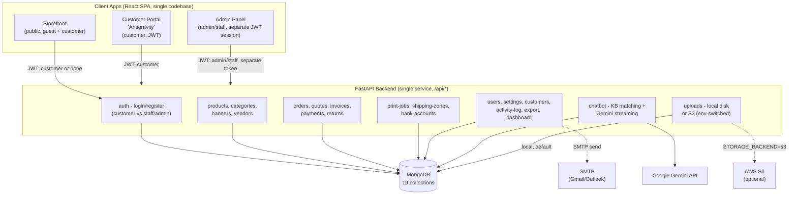
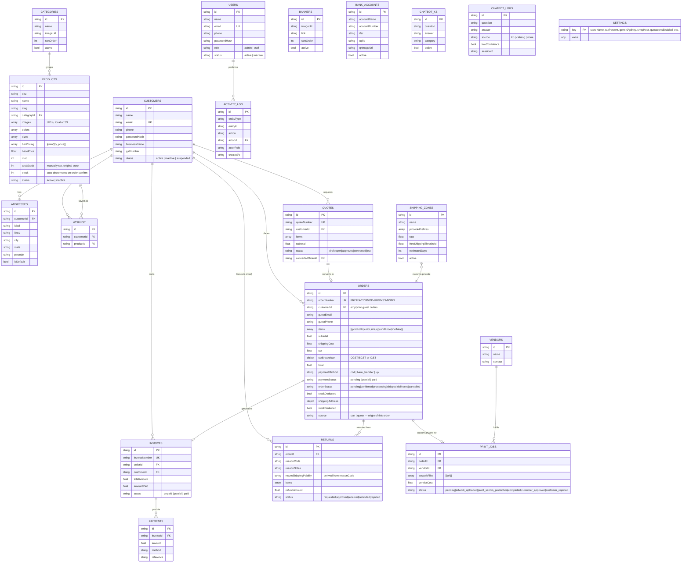

# Antigravity Wholesale — B2B Clothing SaaS Platform

A wholesale clothing B2B platform: public storefront, a logged-in customer portal ("Antigravity"), a full admin back-office, and an AI chatbot — built on FastAPI + MongoDB + React.

This README is the single source of truth for the project's current state. Update it whenever a change materially affects architecture, schema, setup, or feature scope, so future work (by you, or by Claude in a fresh conversation) can start from files alone.

---

## 1. Tech Stack

| Layer | Technology |
|---|---|
| Frontend | React 19, React Router 6, Tailwind CSS, shadcn/ui (Radix), Craco |
| Backend | FastAPI (Python), Motor (async MongoDB driver), Pydantic v2 |
| Database | MongoDB |
| Auth | JWT (PyJWT), bcrypt password hashing |
| AI Chatbot | Google Gemini API via the official `google-genai` SDK (direct — no third-party LLM wrapper) |
| Email | SMTP (`smtplib`, stdlib) — Gmail/Outlook App Password style |
| File Storage | Local disk by default; one-line switch to AWS S3 (`STORAGE_BACKEND=s3`) |
| Bulk Import | `.csv` and `.xlsx` (via `openpyxl`) product import |
| Containerization | Docker + Docker Compose (3 services: frontend, backend, mongo) |
| Deployment | AWS EC2 (Ubuntu) for containerized self-hosted demo; Render (backend) + Vercel (frontend) + MongoDB Atlas for the always-on public demo |

---

## 2. Architecture



**Key architectural decisions:**
- **Two separate auth sessions, one backend.** Customers and admin/staff each get their own JWT stored under different `localStorage` keys on the frontend (`auth_token` vs `admin_token`), so a browser can be logged into the Portal as a customer *and* the Admin Panel as staff simultaneously. Every backend route is still guarded by `require_roles(...)` server-side regardless of what the frontend shows.
- **No third-party LLM wrapper.** The chatbot calls Google's `google-genai` SDK directly (async, streamed). An earlier Emergent-platform-only wrapper (`emergentintegrations`) was fully removed - it only worked inside Emergent's own hosting and would 503 everywhere else.
- **File storage is swappable in one line.** All image URLs flow through a single backend upload endpoint and a single frontend `resolveImageUrl()` helper. Local disk is the default; setting `STORAGE_BACKEND=s3` in `.env` (plus AWS credentials) switches every future upload to S3 with no frontend changes.
- **Server-side price/stock authority.** Order totals, tax, shipping, and MOQ are always recalculated server-side at checkout - the client never dictates pricing.

---

## 3. Database Schema

MongoDB, 19 collections. Relationships below are logical (referenced by string ID), not enforced foreign keys - Mongo has no native FK constraints, so referential integrity is maintained in application code.



**Notes on a few fields that aren't self-explanatory:**
- `products.totalStock` vs `products.stock` - `totalStock` is what was originally received (admin-set, doesn't auto-change); `stock` is current/remaining and auto-decrements when an order is **confirmed** (not at checkout), and is restored if a confirmed order is later cancelled. `stock` can never exceed `totalStock` - enforced both client and server side.
- `orders.stockDeducted` - internal guard flag preventing double-deduction if an order's status flips around.
- `orders.orderNumber` format - `PREFIX-YYMMDD-HHMMSS-NNNN`, where `NNNN` is 4 random digits (deliberately digits only, not hex, so it's easy to read aloud over a phone call).
- `settings` also controls quotation gating: `quotationsEnabled` (bool), `quotationMinQty`, `quotationMinPrice`, `quotationRequireBoth` (bool) — together decide when "Request a Quote" is shown to a customer, and whether both thresholds are required or just one.
- `settings` also controls the low-stock alert threshold: `lowStockThresholdPercent` (number, % of a product's Total Stock) — used by the Dashboard's low-stock list instead of a flat number.
---

## 4. Feature List

### 4.1 Storefront (public)
- Catalog with category filter + search
- Product detail page: color/size matrix, tier pricing display, MOQ enforcement, image gallery, video embed
- Cart: per-customer persistence (see 4.6), MOQ validation before checkout
- "Request a Quote Instead" option in cart, shown only once the cart meets an admin-configured minimum (quantity and/or subtotal)
- Checkout: guest or logged-in, COD/Bank Transfer/UPI, live shipping + tax calculation, GST split (CGST/SGST intra-state, IGST inter-state)
- Order confirmation + printable invoice (print-only CSS, no nav/buttons in the printed output)
- Out-of-stock handling: Catalog badge + disabled/relabeled "Out of Stock" button on PDP once stock hits 0; server-side rejects any order exceeding available stock, whether at checkout or at confirmation time (closes a real race where multiple pending orders could collectively oversell)
- AI chatbot widget (see 4.5)

### 4.2 Customer Portal ("Antigravity")
- Dashboard: active orders, total spent (excludes cancelled), pieces ordered (only counts confirmed+ orders), recent orders
- My Orders: full list + status filter, detail view with visual status timeline
- My Quotes: Request a quote from the cart (gated by admin-set quantity/price thresholds), then track status read-only.
- Order detail also surfaces, when relevant: **Artwork Proof** review (approve/reject once admin sends a proof) and **Request Return/Replacement** (delivered orders only, within a 7-day window, reason-coded)
- Wishlist
- Saved Addresses: multiple, one default, reusable at checkout, enforced single-default server-side
- Profile: edit-gated (must click Edit before fields become editable), name/phone mandatory with format validation

### 4.3 Admin Panel (all 14 PRD modules)
| Module | Notes |
|---|---|
| Dashboard | total sales, open orders, AOV, sales-over-time (day/week/month/year), top-selling items w/ images, order status + cart-vs-quote breakdown, revenue by category, configurable low-stock threshold |
| Products | full CRUD, drag-and-drop image upload/reorder, YouTube embed, tier pricing editor, MOQ, Total/Current stock, **bulk import via CSV/XLSX** with a downloadable template (frozen+locked header) |
| Categories & Banners | CRUD, sort order, active toggle |
| Orders | full pipeline (pending to confirmed to processing to shipped to delivered), cancel (any pre-delivered state), one-click invoice generation (idempotent), guest/registered customer contact info shown |
| Quotations | draft→open→approved→converted/lost, convert-to-order, admin can edit line pricing/quantity on a submitted quote (blocked once converted/lost), **gated visibility on the storefront via Settings (min qty/price threshold)** |
| Invoices | generate, **real email delivery via SMTP**, print, record payments |
| Payments Ledger | all payments + running Total Invoiced / Paid / Outstanding |
| Returns / RMA | requested to approved to received to refunded/rejected, blocked pre-delivery |
| Print Jobs & Artwork | vendor assignment + cost, artwork upload, status pipeline, customer proof approval, **audit trail**, delete |
| Shipping Zones | pincode-prefix rates, free-shipping threshold (correctly handles `0` = always free) |
| Bank Accounts | admin-only end to end, shown to customers at checkout |
| Settings | tabbed (Branding / Tax & Shipping / Seller Details / AI Config / Email SMTP), **edit-gated per tab** |
| User Management | Staff/Admin (create/edit/delete, last-admin protected) + Customers (view, phone shown, permanent suspend) |
| Knowledge Base | Q&A CRUD + conversation log viewer with confidence badges |

Role gating (FR-8): Settings and User Management are admin-only, both server-enforced (`require_roles('admin')`) and hidden client-side for staff.

### 4.4 Order Numbering
`ORD-YYMMDD-HHMMSS-NNNN` (also `QT-` for quotes, `INV-` for invoices) - date + time + a 4-digit random suffix, fully speakable over a phone call for support lookups.

### 4.5 AI Chatbot
- Answers from three sources: admin-curated Knowledge Base, live product catalog (keyword-matched), and store policy (from Settings)
- **Authenticated customers get scoped order-status access** - only triggered when the question looks order-related (keyword-gated, not sent on every message), only ever their own last 5 orders, with a system-prompt instruction to ask which order rather than dumping the full list on a vague question
- Falls back to a WhatsApp CTA + logs the conversation when it can't answer confidently - both happen together, not either/or
- 5 sample KB entries pre-seeded for testing

### 4.6 Cross-Cutting Fixes Worth Knowing About
- **Cart is per-customer**, not global - a single shared `localStorage` key used to leak one person's cart to the next person/account using the same browser. Now scoped per customer ID, with guest-cart-merges-into-account-on-login (Amazon/Flipkart-style), and the previous customer's cart persists untouched for their next login.
- **Mandatory contact info**: name/email/phone required with format validation (10-digit Indian mobile pattern) for customers, staff, and admin alike - staff/admin accounts didn't even have a phone field before.
- Image URLs (`resolveImageUrl`) correctly resolve both local (`/uploads/...`) and absolute (S3 or seed-data external) URLs everywhere they're rendered.

---

## 5. Setup

### Prerequisites
- Python 3.11, Node.js 20, MongoDB running somewhere reachable

### Backend
```bash
cd backend
python3.11 -m venv venv
source venv/bin/activate
pip install -r requirements.txt --break-system-packages
```

Create `backend/.env`:
```dotenv
# Local dev: mongodb://localhost:27017
# Docker/Compose: mongodb://mongo:27017
# Atlas: mongodb+srv://<user>:<password>@<cluster-url>/
MONGO_URL=

DB_NAME=wholesale_saas

# Any long random string (used to sign JWTs) — generate with: openssl rand -hex 32
JWT_SECRET=

# Local dev: http://localhost:3000
# Docker/EC2: http://<instance-public-ip>:3000
# Vercel: https://<your-app>.vercel.app
CORS_ORIGINS=

# Optional — chatbot degrades gracefully without it
GEMINI_API_KEY=
GEMINI_MODEL=gemini-3.5-flash

# Optional — invoice email will 400 with a clear message if unset
# Gmail: smtp.gmail.com, port 587, and an App Password (not your normal Gmail password)
SMTP_HOST=
SMTP_PORT=
SMTP_USER=
SMTP_PASSWORD=

# local = saves to disk; s3 = uploads to AWS S3 (fill AWS_* below if s3)
STORAGE_BACKEND=local
AWS_S3_BUCKET=
AWS_S3_REGION=ap-south-1
AWS_ACCESS_KEY_ID=
AWS_SECRET_ACCESS_KEY=
```

```bash
uvicorn server:app --reload --port 8000
```
Seed data (categories, sample products, admin/customer test accounts, bank account, 5 KB entries) loads automatically on first startup.

### Frontend
```bash
cd frontend
nvm use 20
npm install --legacy-peer-deps
```

Create `frontend/.env`:
```dotenv
# Local dev: http://localhost:8000
# Docker/EC2: http://<instance-public-ip>:8000
# Render: https://<your-backend>.onrender.com
# Note: this value is compiled into the static build at build time (CRA behavior) —
# changing it after building requires a rebuild, not just editing this file.
REACT_APP_BACKEND_URL=
```

```bash
npm start
```

### URLs
- Storefront: `http://localhost:3000`
- Customer Portal: `http://localhost:3000/portal/dashboard` (after login)
- Admin Panel: `http://localhost:3000/admin/login`
- API docs (Swagger): `http://localhost:8000/docs`

### Test credentials (auto-seeded)
| Role | Email | Password |
|---|---|---|
| Admin | admin@example.com | ChangeMe123! |
| Customer | buyer1@example.com | buyer123 |

---

## 6. Containerized Deployment (Docker + AWS EC2)

The full stack can also run as three Docker containers via Docker Compose — useful for a self-hosted demo independent of Render/Vercel/Atlas.

### Files
```
duskft-ecommerce/
+-- docker-compose.yml
+-- install-docker.sh # idempotent: installs Docker, Compose plugin, configures swap
+-- backend/
| +-- Dockerfile
| +-- .dockerignore
+-- frontend/
| +-- Dockerfile # multi-stage: Node build -> Nginx serve
| +-- nginx.conf
| +-- .dockerignore

### Quick start (fresh Ubuntu instance)
```bash
git clone <repo-url>
cd duskft-ecommerce
./install-docker.sh        # installs Docker + Compose + swap, only if missing
newgrp docker              # only needed if Docker was just installed
docker compose up --build -d
```

### Required config before first build
- `backend/.env` — same variables as local setup (Section 5), but `MONGO_URL` must point to the Compose service name, not `localhost`:
```
MONGO_URL=mongodb://mongo:27017
CORS_ORIGINS=http://<instance-public-ip>:3000
```

- `docker-compose.yml` — `REACT_APP_BACKEND_URL` build arg must be set to `http://<instance-public-ip>:8000`

  **Important:** this value is compiled into the frontend's static JS bundle at build time (CRA behavior), not read at runtime. If the instance's public IP changes, the frontend image must be rebuilt (`docker compose build --no-cache frontend`) — editing `.env` alone won't update an already-built image.

### AWS-specific setup
- EC2 Security Group must allow inbound TCP on ports `3000` (frontend) and `8000` (backend)
- Instance needs at least ~2GB usable memory (RAM + swap) to survive the frontend's production build (`npm run build`) without being OOM-killed — `install-docker.sh` auto-configures 2GB swap on instances with under ~2GB RAM
- Recommended minimum EBS volume: 15-16GB (Docker images + build cache for this stack run 2-3GB; a default 8GB volume fills up fast across rebuilds)

### Useful commands
```bash
docker compose logs -f backend       # tail backend logs
docker compose down                  # stop, keep data
docker compose down --volumes        # stop, wipe Mongo data too
docker system df                     # see image/cache disk usage
docker system prune -a -f --volumes  # reclaim all unused Docker disk space
```

### CI/CD (GitHub Actions)

`.github/workflows/deploy.yml` auto-deploys to EC2 on every push to `main`:
1. SSHs into the instance
2. Pulls latest code
3. Rebuilds and restarts containers (`docker compose up --build -d`)
4. Runs a health check (`curl` against `/docs`) — the workflow fails if the backend doesn't come up clean

**Required GitHub Secrets** (repo Settings → Secrets and variables → Actions):

| Secret | Value |
|---|---|
| `EC2_HOST` | instance's public IP |
| `EC2_USERNAME` | `ubuntu` |
| `EC2_SSH_KEY` | full contents of the `.pem` private key |

**Note:** if the instance's public IP ever changes (e.g. after a stop/start without an Elastic IP), update `EC2_HOST` here, `CORS_ORIGINS` in `backend/.env`, and the `REACT_APP_BACKEND_URL` build arg in `docker-compose.yml` — then rebuild the frontend image, since that value is baked in at build time.

---


## 7. Known Gaps / Roadmap

- **QR/UPI real payment gateway** - currently a display-only bank/UPI QR at checkout, not an integrated payment gateway (no auto-confirm on payment).
- **Mobile responsiveness** - Storefront and Portal are responsive; the Admin Panel was built desktop-first and hasn't had a dedicated mobile pass.
- **S3** - the switch is built and unit-verified, but not yet tested end-to-end against real AWS credentials.
- **Guest order lookup** - a guest can view their own order confirmation immediately after checkout (session-stored), but has no way to look it up again later without creating an account (no lookup-by-order-number+email flow).
- **Excel bulk import** - image columns accept URLs only; a spreadsheet can't carry actual image files, so bulk-imported products need photos added afterward via Edit.
- **CI/CD:**  Done — GitHub Actions auto-deploys to EC2 on every push to `main`, with a health check that fails the pipeline if the app doesn't come up clean. See Section 6.---

## 8. Project Structure

```
duskft-ecomerce/
+-- .github/
|   +-- workflows/
|       +-- deploy.yml
+-- docker-compose.yml
+-- install-docker.sh
+-- backend/
|   +-- server.py           # FastAPI app, router registration, static file mount
|   +-- models.py           # All Pydantic document models
|   +-- database.py         # Motor client
|   +-- deps.py             # Auth dependencies (get_session, require_roles, etc.)
|   +-- auth_utils.py       # Password hashing, JWT
|   +-- business.py         # Pricing, tax, shipping, stock, email, validators
|   +-- seed.py             # Idempotent default data
|   +-- routers/            # One file per resource (20 routers)
|   +-- Dockerfile
|   +-- .dockerignore
+-- frontend/
| +-- Dockerfile
| +-- .dockerignore
| +-- nginx.conf
    +-- src/
        +-- App.js           # All routing
        +-- layouts/         # StorefrontLayout, PortalLayout, AdminLayout
        +-- context/         # AuthContext (customer), AdminAuthContext (staff/admin), CartContext
        +-- pages/           # Storefront pages
        +-- pages/portal/    # Customer Portal pages
        +-- pages/admin/     # Admin Panel pages
        +-- components/      # Shared components (ChatWidget, CartDrawer, ProductCard, admin/ImageUploader)
        +-- lib/              # api.js (fetch helpers, resolveImageUrl), pricing.js
```
